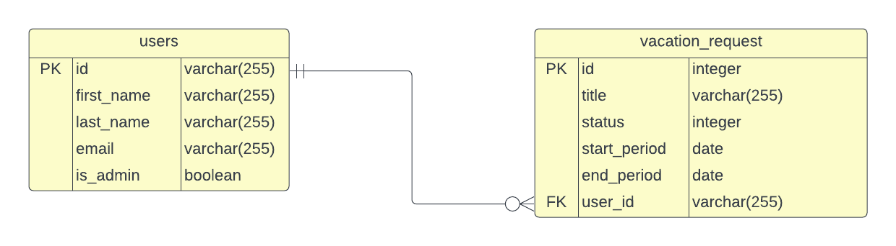

# Case assignment for Noroff - Tidsbanken

[](https://github.com/RichardLitt/standard-readme)
[](https://github.com/accez/Java-assignment-2/actions/workflows/docker-image.yml)
[](https://github.com/accez/Java-assignment-2/actions/workflows/heroku-deployment.yml)
[](https://spring-test-java-assignment.herokuapp.com/)
[](https://github.com/accez/Java-assignment-2/pkgs/container/springtest)


An application to manage requests for vacation time for employees.

## Table of Contents

- [Background](#background)
- [Install](#install)
- [Usage](#usage)
- [API](#api)
- [Maintainers](#maintainers)
- [Contributing](#contributing)
- [License](#license)

## Background
Tidsbanken have approached the candidates and requested that a solution for managing
requests for vacation time for their employees. The application serves a dual purpose.
Firstly, it serves to manage the request and approval process of vacation days for employees and ease the burden of communication. Secondly, the application serves to inform
employees about each other’s approved vacation days so that teams may adequately plan
for periods of absence. 

### Goal

The primary purpose of the case is to utilize a selection of possible development options to produce a single
software solution that demonstrates each candidate's capabilities as developer. The candidates
must produce a software solution that is considered a final product.

The backend application consists of the following:
- An OpenAPI configuration endpoint at ``/v3/api-docs``
- The Swagger documentation UI at ``/swagger-ui/index.html``
- API endpoint for vacation request and users.
- Authentication using 0Auth

The CI-pipeline will:

- Package the built application into a Docker image, proceeding if successful.
- Push the Docker image to the local registry on Github.
- Trigger the build pipeline on Heroku to pull the latest image and replace the current running dyno.


[Application Demo](https://time-bank-app-fe.herokuapp.com/)

[Swagger UI Docs](https://time-bank-api-be.herokuapp.com/swagger-ui/index.html)

## Install
Clone the git repository.

Maven will automatically initialize itself and download necessary dependencies the first time the wrapper is run. No explicit installation necessary.


## Usage
Open in your favorite IDE and run the project.
## API
Vacation Request controller
```
GET api/v1/vacation/all
GET api/v1/vacation/approved
GET api/v1/vacation/id/{vacation_id}
GET api/v1/vacation/{user_id}
DELETE api/v1/vacation/{vacation_id}
POST api/v1/vacation/{user_id}/create
PATCH api/v1/vacation/{request_id}
```

User controller
```
GET api/v1/user/{user_id}
GET api/v1/user/{user_id}/requests
GET api/v1/user/role/{user_id}
GET api/v1/user/changePassword/{email}
GET api/v1/user/all
DELETE api/v1/user/{user_id}
PATCH api/v1/user/{user_id}
POST api/v1/user/createUser
```



## Maintainers

[Rickard Cruz (@cruz120)](https://github.com/cruz120)

[Aidin Ghassemloi (@aidingh)](https://github.com/aidingh)

[Love Beling (@mikaellove)](https://github.com/mikaellove)

[Simon Palmgren Arvidsson (@accez)](https://github.com/accez)


## Contributing
Special thanks to Lukas Mårtensson (DTO master)

Small note: If editing the README, please conform to the [standard-readme](https://github.com/RichardLitt/standard-readme) specification.

## License

MIT © 2022 
